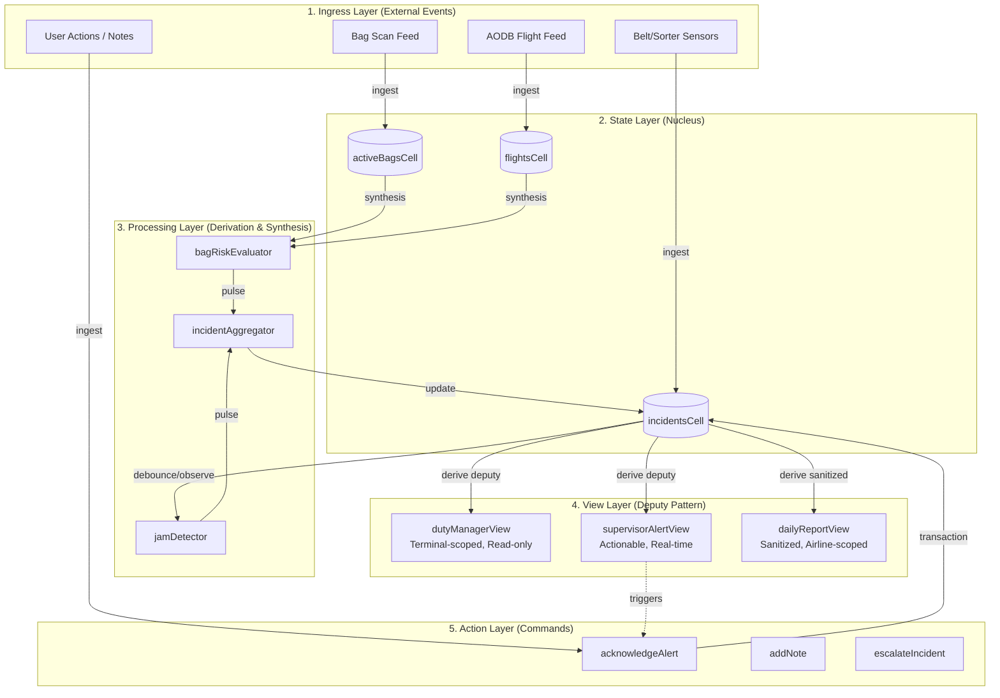
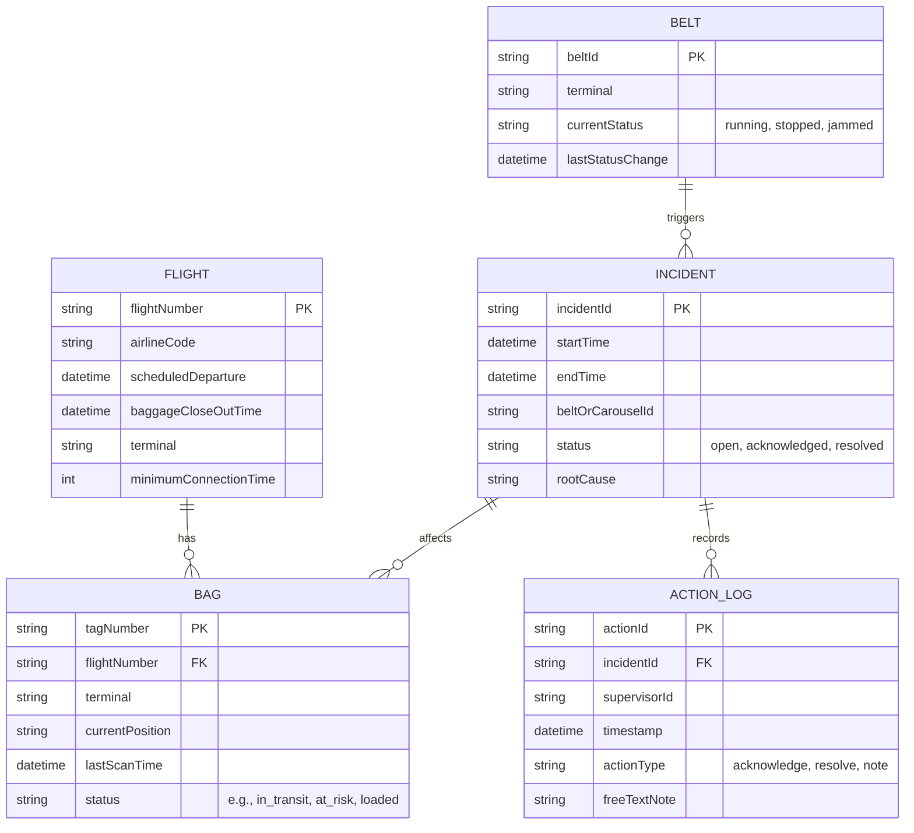
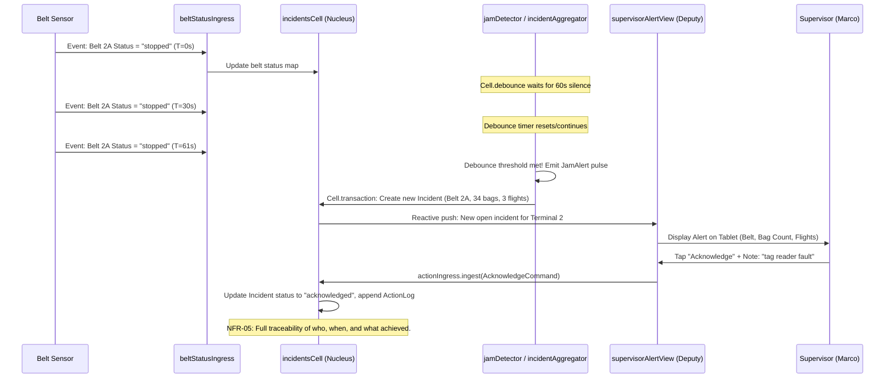

***

# Baggage Flow Watch - Software Design Walkthrough

## 1. Overview
This document outlines the software architecture for the **Baggage Flow Watch** system, designed using the **Cell Framework** (Mitosis). The Cell Framework provides a reactive, causal, and highly testable foundation ideal for real-time operational systems requiring strict data integrity, role-based views (Deputy pattern), and complex event aggregation.

## 2. Architectural Layers
The system is divided into five logical layers aligned with Cell Framework principles. The diagram below illustrates how data flows unidirectionally through these layers, ensuring causal integrity and predictable state management.



## 3. Component Design & BRD Mapping

### 3.1 Ingress Components (Data Entry)
- **`bagScanIngress`** (`Cell.ingress<BagScanEvent>`): Captures bag tag, position, and timestamp (DR-01, FR-01).
- **`flightDataIngress`** (`Cell.ingress<FlightUpdateEvent>`): Captures AODB updates for scheduled departure and baggage close-out times (DR-02).
- **`beltStatusIngress`** (`Cell.ingress<BeltStatusEvent>`): Captures belt/sorter/carousel operational status (running/stopped) (FR-05).
- **`actionIngress`** (`Cell.ingress<SupervisorAction>`): Captures alert acknowledgements, free-text notes, and resolutions (FR-07, FR-11).

### 3.2 State Components (Nucleus)
- **`activeBagsCell`** (`Cell.state<Map<String, BagState>>`): Holds the real-time state of all departing bags, keyed by tag number.
- **`flightsCell`** (`Cell.state<Map<String, FlightState>>`): Holds flight schedules, airline codes, and close-out deadlines.
- **`incidentsCell`** (`Cell.state<Map<String, IncidentState>>`): Tracks grouped incidents, their status (open, acknowledged, resolved), and audit trails (DR-03, DR-04).

### 3.3 Processing Components (Business Logic)
- **`bagRiskEvaluator`** (`Cell.synthesis`): Combines `activeBagsCell` and `flightsCell`. Calculates time remaining and flags bags as "at risk" if time < minimum connection time (FR-02, FR-03). Enforces BR-02 (no alerts for closed flights).
- **`jamDetector`** (`Cell.debounce` + `Cell.observe`): Monitors `beltStatusIngress`. If a belt remains "stopped" for >60 seconds, it emits a `JamAlert` pulse (FR-05, FR-06).
- **`incidentAggregator`** (`Cell.synthesis`): Groups individual `BagRisk` and `JamAlert` pulses into a single `Incident` based on shared cause, belt, or carousel (FR-08).

### 3.4 View Components (Deputy Pattern)
- **`dutyManagerView`** (`Cell.derive`): Projects a filtered, terminal-specific view of open incidents and at-risk bags. Returned as a `deputy` to ensure read-only access for the UI, enforcing role-based security (NFR-04, FR-04).
- **`dailyReportView`** (`Cell.derive`): Aggregates resolved incidents and bag metrics by airline code for the Airline Liaison Officer (Chen), ensuring no passenger personal data is included via `Cell.sanitized` (BR-04, FR-10, AR-01).

## 4. Domain Model & Entity Relationships
The following diagram illustrates the core data structures and their relationships, ensuring all Data Requirements (DR-01 to DR-06) are met.



## 5. Key Business Logic Flow (Jam Detection & Risk)
This sequence diagram demonstrates how the system handles a real-world scenario (User Journey 9.1: Morning peak — spotting a jam), showcasing the reactive nature of the Cell Framework.



## 6. Example Implementation (Dart / Cell Framework)

Below are illustrative code snippets demonstrating how the Cell Framework addresses key BRD requirements.

### 6.1 Real-time Bag Risk Evaluation (FR-02, FR-03, BR-02)
```dart
// Synthesis of bag state and flight state to determine risk
final bagRiskEvaluator = Cell.synthesis2<Map<String, BagState>, Map<String, FlightState>, Map<String, BagRiskStatus>>(
  cell1: activeBagsCell,
  cell2: flightsCell,
  combine: (bags, flights) {
    final risks = <String, BagRiskStatus>{};
    for (final bag in bags.values) {
      final flight = flights[bag.flightNumber];
      if (flight != null) {
        // BR-02: No alert may be raised for a bag on a flight that has already closed.
        if (DateTime.now().isBefore(flight.baggageCloseOutTime)) {
          final timeRemaining = flight.baggageCloseOutTime.difference(bag.lastScanTime);
          if (timeRemaining.inMinutes < flight.minimumConnectionTime) {
            risks[bag.tagNumber] = BagRiskStatus(
              tag: bag.tagNumber,
              flight: bag.flightNumber,
              terminal: bag.terminal,
              timeRemaining: timeRemaining,
              isAtRisk: true,
            );
          }
        }
      }
    }
    return risks;
  },
);
```

### 6.2 Jam Detection with Temporal Operators (FR-05, FR-06)
```dart
// Holds the latest status of each belt
final beltStatusState = Cell.state<Map<String, BeltStatusEvent>>({});

// Link ingress to state
beltStatusIngress.link(beltStatusState); 

// Derive a stream of belts that have been stopped for > 60 seconds
final jamAlertCell = Cell.debounce(
  source: beltStatusState,
  duration: Duration(seconds: 60),
);

Cell.observe(
  source: jamAlertCell,
  effect: (pulse) {
    final beltStates = pulse.payload;
    for (final entry in beltStates.entries) {
      if (entry.value.status == BeltStatus.stopped) {
        // Trigger incident creation via transaction for causal integrity
        Cell.transaction(() {
          incidentIngress.ingest(IncidentCommand.createJamAlert(
            beltId: entry.key,
            terminal: entry.value.terminal,
            timestamp: DateTime.now(),
          ));
        });
      }
    }
  },
).start();
```

### 6.3 Role-Based Restricted View (Deputy Pattern) (NFR-04, FR-04)
```dart
// Duty Manager (Priya) gets a filtered, read-only view of her terminal
Cell<Map<String, IncidentState>> getDutyManagerView(String terminalId, Context userContext) {
  // Derive only open incidents for this specific terminal
  final terminalIncidents = Cell.derive<Map<String, IncidentState>, Map<String, IncidentState>>(
    source: incidentsCell,
    map: (allIncidents) {
      return allIncidents.entries
          .where((e) => e.value.terminalId == terminalId && e.value.status == IncidentStatus.open)
          .map((e) => MapEntry(e.key, e.value))
          .toMap();
    },
  );

  // Return as a deputy to enforce read-only, restricted access (NFR-04)
  // The deputy cannot mutate the underlying incidentsCell.
  return terminalIncidents.deputy(
    rules: DeputyRules(
      canUpdate: false,
      canObserve: true,
      contextFilter: (ctx) => ctx.hasRole('DutyManager') || ctx.hasRole('BaggageSupervisor'),
    ),
  );
}
```

## 7. Addressing Non-Functional Requirements (NFRs)
| NFR | Cell Framework Solution |
|---|---|
| **NFR-01** (Update < 5s) | Reactive graph ensures state updates propagate synchronously and efficiently without polling. |
| **NFR-03** (120k events/day) | `Cell.state` maps are optimized for in-memory O(1) lookups. High-volume ingress can be batched using `Cell.transaction` to reduce propagation overhead. |
| **NFR-04** (Role-based Security) | The **Deputy pattern** ensures UI components only receive `unmodifiable` views of the data, scoped by the user's `Context`. |
| **NFR-05** (Auditability) | All state transitions in `incidentsCell` are driven by explicit `Pulse` commands via `actionIngress`, providing a natural, immutable audit trail. |
| **NFR-07** (GDPR/CAA Compliance) | `dailyReportView` uses `Cell.sanitized` to redact any passenger personal data before egress to the Airline Liaison team (BR-04). |

## 8. Next Steps & Validation
1. **Define Data Contracts**: Finalize strict Dart data classes for `BagScanEvent`, `FlightState`, and `IncidentState` (addressing DR-06 rejection rules).
2. **Simulate Acceptance Criteria**: Implement mock ingress streams to simulate the 60-second belt stop (AC-03) and known at-risk bag scenarios (AC-02).
3. **Co-Design Workshops**: Use the `dutyManagerView` output schema in weekly workshops with Priya (Duty Manager) and Marco (Supervisor) to validate the UI layout and ensure the "one screen, one view" goal is met.
4. **Resolve Open Questions**: Answer Q-01 (Terminal 3 feed compatibility) and Q-03 (escalation policy) to finalize the `jamDetector` escalation logic (e.g., adding a secondary `Cell.throttle` to escalate to Duty Manager if unacknowledged in 15 mins).

*** 

*Note: The Mermaid diagrams above can be copied directly into any Markdown viewer that supports Mermaid (like GitHub, GitLab, or Obsidian) to instantly generate visual architecture and flow diagrams.*